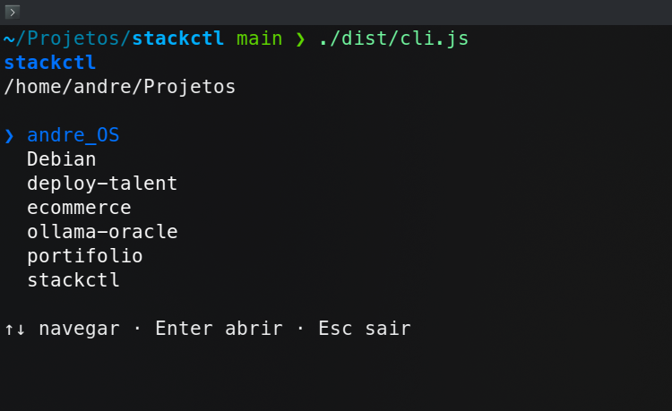
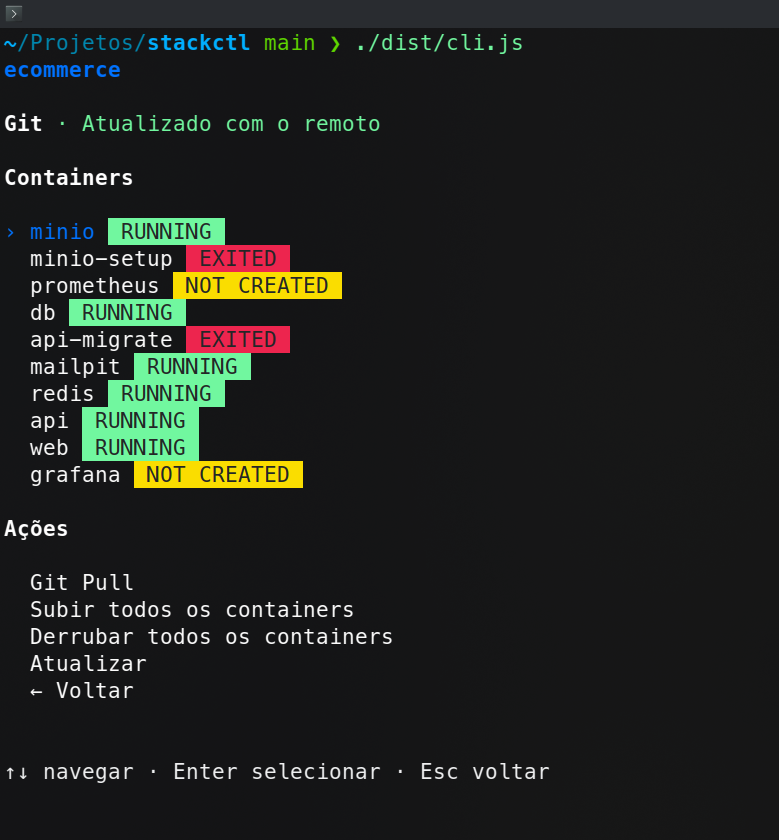
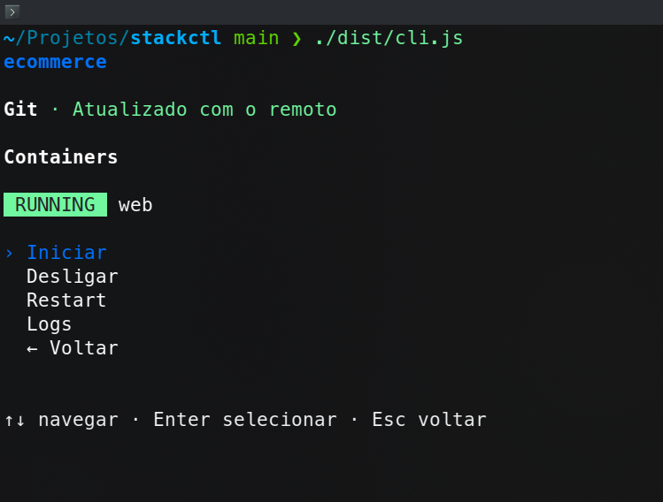
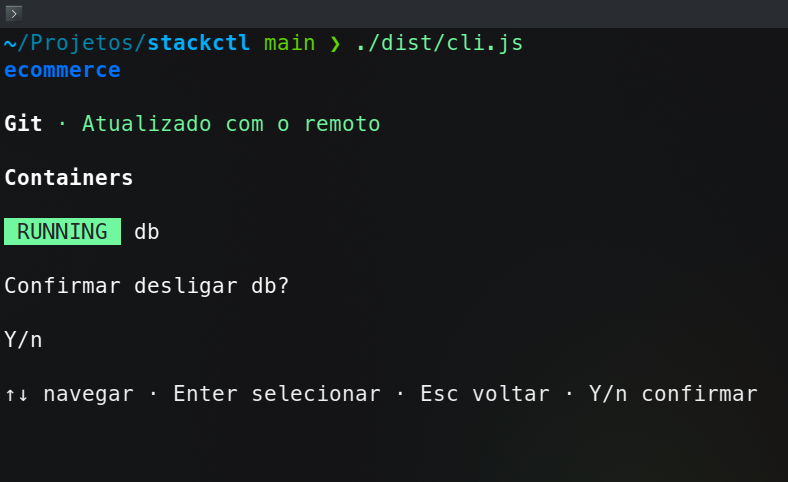
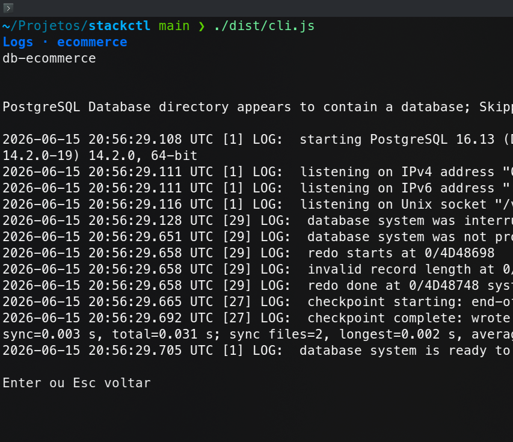

# Screenshots

Visualização das telas do stackctl rodando no terminal.

## Lista de projetos

Navegue pelos repositórios em `PROJECTS_ROOT` e abra um com Enter. Esc sai do app.

## Dashboard do projeto

Status do Git, containers com badge colorido e ações gerais (pull, subir/derrubar stack, atualizar).

## Ações do container

Ao selecionar um container, aparece o submenu com iniciar, desligar, restart e logs.

## Confirmação

Ações destrutivas pedem confirmação com Y/n antes de executar.

## Logs

Últimas 100 linhas do container selecionado. Enter ou Esc volta ao dashboard.

